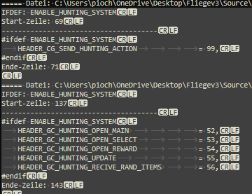
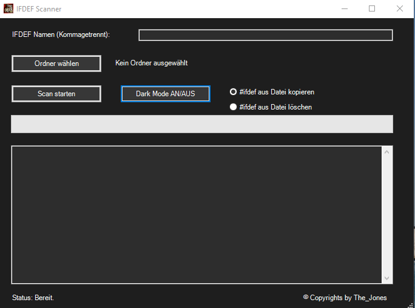

# M2Multi-Tool

Ein vielseitiges Windows-Tool für die Entwicklung und Wartung von M2-Projekten.

## 📋 Übersicht

M2Multi-Tool ist ein All-in-One-Tool, das verschiedene Entwicklungsaufgaben vereinfacht. Das Tool wird kontinuierlich weiterentwickelt und regelmäßig aktualisiert.

## ✨ Features

### 🔍 Define Scanner
- **Scannt** deinen SRC-Ordner nach angegebenen `#ifdef`-Direktiven
- **Durchsucht** alle `.cpp` und `.h` Dateien
- **Kopiert** Code-Blöcke von `#ifdef` bis `#endif` in eine separate Datei
- **Löscht** optional Code-Blöcke direkt aus den SRC-Dateien
- **Automatisches Backup** vor dem Löschen
- **Mehrfach-Suche**: Gleichzeitig mehrere `#ifdef`s suchen (z.B. `ENABLE_1`, `ENABLE_2`, `ENABLE_3`)

### 🧹 Locale Cleaner
- Bereinigt und verwaltet Locale-Dateien
- *Aktuell im Wartungsmodus*

### 🔗 Integrator
- Integriert Tutorial-Dateien in Source-Ordner
- *Aktuell im Wartungsmodus*

## 🚀 Installation

1. Lade die neueste Version von den [Releases](https://github.com/TheJonesx/M2Multi-Tool/releases) herunter
2. Entpacke die Dateien in einen beliebigen Ordner
3. Starte `M2-Tool.exe`

**Hinweis**: Das Tool muss nicht im SRC-Ordner installiert werden.

## 📖 Verwendung

### Define Scanner

1. Öffne den Tab **"Define Scanner"**
2. Gib die gewünschten `#ifdef`-Namen ein (mehrere durch Komma getrennt)
3. Wähle den SRC-Ordner aus
4. Wähle eine Aktion:
   - **Kopieren**: Code wird in eine separate Datei kopiert
   - **Löschen**: Code wird aus den SRC-Dateien entfernt (mit automatischem Backup)
5. Klicke auf **"Scan starten"**

### Beispiel Output (Kopieren-Funktion)

### Tool-Übersicht

## 🔄 Automatische Updates

Das Tool prüft automatisch beim Start auf verfügbare Updates. Du kannst Updates auch manuell mit **Strg+U** prüfen.

## 🌍 Sprachen

- 🇩🇪 Deutsch
- 🇬🇧 English

Die Sprache kann über das Menü im Header geändert werden.

## ⚠️ Wichtige Hinweise

- **Lösch-Funktion**: Verwende die Lösch-Funktion aktuell noch mit Vorsicht, da `#else`-Blöcke noch mit gelöscht werden. Dies wird in einer zukünftigen Version verbessert.
- **Backup**: Vor dem Löschen wird automatisch ein Backup erstellt.

## 🛠️ Technische Details

- **Framework**: .NET 8.0 Windows Forms
- **UI**: ReaLTaiizor
- **Plattform**: Windows

## 📝 Entwicklung

Das Tool befindet sich in stetiger Entwicklung. Neue Features und Verbesserungen werden regelmäßig hinzugefügt.

### Geplante Features
- Verbesserte Lösch-Funktion (saubere `#else`-Behandlung)
- Aktivierung von Locale Cleaner und Integrator
- Weitere Tools und Funktionen

## 🐛 Fehler melden & Feedback

Fehler, Vorschläge und allgemeines Feedback können über [GitHub Issues](https://github.com/TheJonesx/M2Multi-Tool/issues) gemeldet werden.

## 📄 Lizenz

Dieses Tool wurde von mir entwickelt und ist keine Inspiration von anderen Projekten.

---

**Version**: 1.0.0  
**Letzte Aktualisierung**: 2025-01-01
